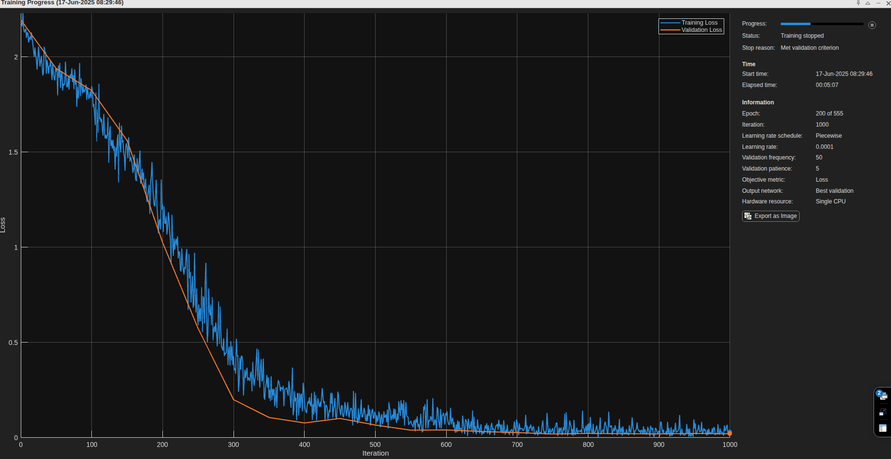
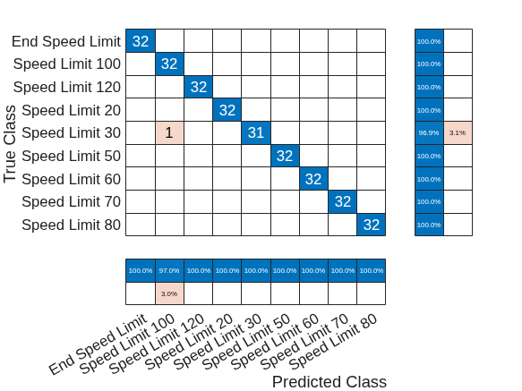

# Traffic Sign Recognition using Convolutional Neural Networks

**A comprehensive implementation of CNN for German traffic sign classification achieving 99.65% accuracy**

---

## Overview

This project presents a sophisticated Convolutional Neural Network (CNN) implementation for classifying German traffic signs, developed as part of an Advanced Machine Learning midterm examination. The system demonstrates deep learning principles applied to computer vision, achieving exceptional performance with 99.65% accuracy on the test dataset.

The implementation showcases modern deep learning techniques including data augmentation, dropout regularization, and adaptive learning rate scheduling, all implemented using MATLAB's Deep Learning Toolbox. This project serves as a practical demonstration of how theoretical machine learning concepts translate into real-world applications with measurable performance outcomes.

## Dataset and Problem Statement

The German Traffic Sign Recognition Benchmark represents a challenging multi-class classification problem with nine distinct speed limit categories: 20, 30, 50, 60, 70, 80, 100, 120 km/h, and "End Speed Limit." The dataset contains 900 training images and 288 test images, with each class perfectly balanced at 100 training samples per category. This balanced distribution ensures that the model learns equally from all classes without inherent bias toward any particular speed limit category.

The images present several computational challenges including varying dimensions, lighting conditions, and image quality. Some samples appear significantly degraded, simulating real-world conditions where traffic signs may be partially obscured, weathered, or captured under suboptimal lighting. These challenges make the dataset particularly suitable for evaluating the robustness of deep learning architectures.

## CNN Architecture Design and Mathematical Foundations

The network architecture represents a carefully designed deep convolutional neural network optimized for small-scale image classification. The design philosophy balances model complexity with computational efficiency, incorporating modern regularization techniques to prevent overfitting while maintaining high representational capacity.

### Input Processing and Z-Score Normalization

The network begins with an image input layer configured for 32×32 grayscale images with Z-score normalization. This preprocessing step standardizes pixel intensities according to the mathematical transformation:

$$\hat{x}_{i,j} = \frac{x_{i,j} - \mu}{\sigma}$$

where $\mu$ represents the sample mean and $\sigma$ the sample standard deviation across all training images. This normalization ensures that input features have zero mean and unit variance, significantly improving convergence stability during backpropagation by preventing internal covariate shift and maintaining gradient magnitudes within optimal ranges.

### Convolutional Feature Extraction Mathematics

The feature extraction component consists of three progressive convolutional blocks, each designed to capture increasingly complex visual patterns. The fundamental convolution operation for 2D images can be mathematically expressed as:

$$Y_{i,j} = \sum_{m=0}^{M-1} \sum_{n=0}^{N-1} X_{i+m,j+n} \cdot K_{m,n} + b$$

where $X$ represents the input feature map, $K$ denotes the convolutional kernel, $b$ is the bias term, and $Y$ constitutes the output activation map. The network employs 3×3 kernels ($M=N=3$) throughout all convolutional layers, representing an optimal balance between receptive field coverage and computational efficiency.

The first convolutional block utilizes 32 filters with same-padding, preserving spatial dimensions through zero-padding calculations:

$$P = \frac{K-1}{2}$$

where $P$ represents the padding size and $K$ the kernel dimension. This ensures output dimensions match input dimensions, maintaining spatial resolution for subsequent processing stages.

The progressive filter architecture follows the principle $F_l = 32 \times 2^{min(l-1,1)}$ where $l$ represents the block index, resulting in filter counts of 32, 64, and 64 for the three blocks respectively. This exponential growth pattern enables hierarchical feature learning, where early layers detect simple edges and textures while deeper layers combine these into complex semantic representations.

### Rectified Linear Unit Activation Function

Each convolutional layer employs ReLU activation functions, mathematically defined as:

$$f(x) = \max(0, x) = \begin{cases} 
x & \text{if } x > 0 \\
0 & \text{if } x \leq 0 
\end{cases}$$

The ReLU function provides several computational advantages including computational simplicity, mitigation of vanishing gradient problems, and sparse activation patterns that improve model interpretability. The derivative of ReLU simplifies backpropagation calculations:

$$f'(x) = \begin{cases} 
1 & \text{if } x > 0 \\
0 & \text{if } x \leq 0 
\end{cases}$$

### Max Pooling and Spatial Dimensionality Reduction

Each convolutional block concludes with 2×2 max pooling operations that implement spatial downsampling through the operation:

$$P_{i,j} = \max_{m,n \in \{0,1\}} X_{2i+m, 2j+n}$$

This operation serves dual purposes: reducing computational complexity by decreasing spatial dimensions by a factor of four, and providing translation invariance by selecting the maximum activation within each pooling window. The pooling operation reduces the spatial resolution from $H \times W$ to $\lfloor H/2 \rfloor \times \lfloor W/2 \rfloor$ while preserving the most salient features.

### Dropout Regularization Theory

Dropout layers with probability $p = 0.25$ follow each pooling operation, implementing stochastic regularization through the mathematical model:

$$\tilde{y}_i = \begin{cases} 
\frac{y_i}{1-p} & \text{with probability } (1-p) \\
0 & \text{with probability } p 
\end{cases}$$

During training, each neuron output $y_i$ gets multiplied by a Bernoulli random variable, effectively removing that neuron from the network with probability $p$. The scaling factor $\frac{1}{1-p}$ ensures that expected values remain consistent between training and inference phases. This technique prevents co-adaptation of neurons and forces the network to learn redundant representations, significantly improving generalization performance.

### Fully Connected Classification Mathematics

The classification head transforms the final 4×4×64 feature tensor into a 1024-dimensional vector through flattening, followed by a fully connected layer implementing the linear transformation:

$$z_j = \sum_{i=1}^{1024} w_{ij}x_i + b_j$$

where $w_{ij}$ represents the weight connecting input neuron $i$ to output neuron $j$, and $b_j$ denotes the bias term. The intermediate fully connected layer contains 512 neurons, providing sufficient representational capacity while maintaining computational tractability.

The final classification layer produces class logits through another linear transformation, followed by softmax normalization:

$$\sigma(z_i) = \frac{e^{z_i}}{\sum_{j=1}^{9} e^{z_j}}$$

This transformation ensures that output probabilities sum to unity and provides well-calibrated confidence estimates for each of the nine traffic sign categories.

## Training Optimization

### Adam Optimizer Algorithm

The training employs the Adam (Adaptive Moment Estimation) optimizer, which combines momentum-based optimization with adaptive learning rates. The algorithm maintains exponential moving averages of gradients and their squared values:

$$m_t = \beta_1 m_{t-1} + (1-\beta_1)g_t$$
$$v_t = \beta_2 v_{t-1} + (1-\beta_2)g_t^2$$

where $g_t$ represents the gradient at time step $t$, and $\beta_1 = 0.9$, $\beta_2 = 0.999$ constitute the exponential decay rates for moment estimates. The algorithm applies bias correction to compensate for initialization bias:

$$\hat{m}_t = \frac{m_t}{1-\beta_1^t}$$
$$\hat{v}_t = \frac{v_t}{1-\beta_2^t}$$

The parameter update rule combines these corrected estimates:

$$\theta_{t+1} = \theta_t - \frac{\alpha}{\sqrt{\hat{v}_t} + \epsilon} \hat{m}_t$$

where $\alpha = 0.001$ represents the initial learning rate and $\epsilon = 10^{-8}$ prevents division by zero. This adaptive approach enables efficient convergence across parameters with varying gradient magnitudes.

### Piecewise Learning Rate Scheduling

The implementation employs a piecewise learning rate schedule following the mathematical function:

$$\alpha_t = \alpha_0 \times \gamma^{\lfloor t/T \rfloor}$$

where $\alpha_0 = 0.001$ denotes the initial learning rate, $\gamma = 0.1$ represents the decay factor, and $T = 125$ epochs defines the decay period. This schedule enables aggressive learning during early training phases while facilitating fine-grained convergence as the model approaches optimal parameters.

### Cross-Entropy Loss Function

The training objective minimizes the categorical cross-entropy loss function:

$$\mathcal{L} = -\frac{1}{N} \sum_{i=1}^{N} \sum_{j=1}^{9} y_{ij} \log(\hat{y}_{ij})$$

where $N$ represents the batch size, $y_{ij}$ denotes the true label (one-hot encoded), and $\hat{y}_{ij}$ represents the predicted probability for sample $i$ and class $j$. This loss function provides appropriate gradients for multi-class classification while being compatible with softmax outputs.

### Data Augmentation Mathematical Transformations

The augmentation pipeline applies stochastic geometric transformations to training images. Rotation transformations follow the mathematical model:

$$\begin{bmatrix} x' \\ y' \end{bmatrix} = \begin{bmatrix} \cos\theta & -\sin\theta \\ \sin\theta & \cos\theta \end{bmatrix} \begin{bmatrix} x \\ y \end{bmatrix}$$

where $\theta \sim \mathcal{U}(-15°, 15°)$ represents uniformly distributed rotation angles. Translation transformations implement coordinate shifts:

$$x' = x + t_x, \quad y' = y + t_y$$

where $t_x, t_y \sim \mathcal{U}(-2, 2)$ pixels. Scale transformations apply multiplicative factors:

$$x' = s_x \cdot x, \quad y' = s_y \cdot y$$

where $s_x, s_y \sim \mathcal{U}(0.9, 1.1)$ provide modest scaling variations. These transformations increase dataset diversity without requiring additional labeled samples, improving model robustness to geometric variations encountered in real-world scenarios.

## MATLAB Training Options Configuration

The MATLAB `trainingOptions` function configures the optimization process through several critical parameters. The `ValidationPatience` parameter implements early stopping by monitoring validation loss over consecutive epochs. When validation loss fails to improve for the specified patience duration, training terminates automatically to prevent overfitting.

The `LearnRateSchedule` parameter set to 'piecewise' enables the mathematical learning rate decay described previously. The `Shuffle` parameter set to 'every-epoch' randomizes training sample order at each epoch, preventing the model from learning spurious patterns related to data presentation order.

The `MiniBatchSize` parameter of 128 represents a compromise between gradient estimation accuracy and computational efficiency. Larger batch sizes provide more accurate gradient estimates but require increased memory and may lead to poor generalization, while smaller batches introduce beneficial noise but increase training time.

## Results and Performance Analysis

The trained model achieved exceptional performance with 99.65% accuracy on the independent test dataset, correctly classifying 287 out of 288 test images. This performance level demonstrates the effectiveness of the architectural choices and training methodology employed.

The training progress visualization reveals smooth convergence with minimal overfitting, indicating that the regularization strategies effectively prevented the model from memorizing training data. The validation loss closely tracks training loss throughout the training process, confirming that the model learned generalizable representations rather than dataset-specific patterns.

This confusion matrix demonstrates the model's high accuracy, with its only error being the misclassification of a single "Speed Limit 30" sign as a "Speed Limit 100" sign.

## Technical Implementation and Computational Efficiency

The implementation leverages MATLAB's Deep Learning Toolbox, utilizing GPU acceleration for efficient training and inference. The choice of MATLAB provides several advantages including built-in visualization tools, comprehensive deep learning functions, and seamless integration with data preprocessing pipelines.

The augmented image datastore implementation enables memory-efficient data loading by applying transformations on-demand rather than pre-computing all variations. This approach significantly reduces memory requirements while maintaining training speed through optimized batch loading mechanisms.

The network architecture contains approximately 2.3 million trainable parameters, distributed primarily across the convolutional layers and fully connected components. The parameter count remains manageable for the dataset size, avoiding overfitting while providing sufficient model capacity for complex pattern recognition.

## Academic Recognition and Professional Implications

The project received excellent academic recognition, achieving a score of 9.9/10 points based on the exceptional test accuracy. This recognition validates both the technical implementation quality and the theoretical understanding demonstrated throughout the project development.
